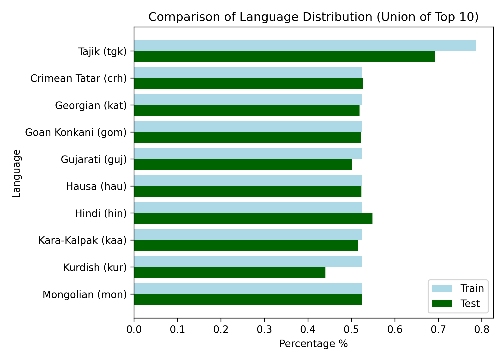

# NLP-CS-2024-25

<p align="center">
  
</p>

Code developed for CentraleSupélec Kaggle competition in the Advanced NLP course

---

<div style="display: flex; gap: 10px;">
  <a href="https://www.kaggle.com/competitions/nlp-cs-2025/overview">[Kaggle competition]</a>
  <a href="https://github.com/PierreColombo/NLP-CS-2024-25/tree/main/kaggle_project">[Instructions]</a>
  <a href="https://github.com/LucasTramonte/NLP-CS-2024-25/blob/main/Assets/Report/Report_NLP.pdf">[Report]</a>
</div>

## Competition Overview

The main goal of this competition is to build an effective text classifier.

## Usage

1. **Install the required packages**:
    ```sh
    pip install -r requirements.txt
    ```

2. **Run the scripts**:
    - To train the any model:
        ```sh
        python <model_script>.py --train_dataset Assets/Data/train_submission.csv --train
        ```
    - To predict the language of a single text using any model:
        ```sh
        python <model_script>.py --predict "Your text here"
        ```
        Replace `<model_script>` with the appropriate script name (e.g., classifier_Tfidf_LR.py, XLM-RoBERTa.py).
    - To generate a submission file using any model:
        ```sh
        python <model_script>.py --test_dataset Assets/Data/test_without_labels.csv --submission submission.csv
        ```

We are utilizing the [DCE](https://dce.pages.centralesupelec.fr/) GPU provided by CentraleSupélec for training our models.

## Data

The dataset used in this competition consists of three columns: `Usage`, `Text`, and `Label`. There are 389 languages in the training data, with the top 20 being:

<p align="center">
  
</p>

## Comparative Analysis Between the Training and Test Datasets

<p align="center">
  
  
</p>

## Results

| Model                          | Kaggle Accuracy               |
|--------------------------------|-----------|
| **TF-IDF with Logistic Regression** | 0.71067 |
| **XLM-RoBERTa**               | 0.88269 |

## References

1. Alexis Conneau, Kartikay Khandelwal, Naman Goyal,Vishrav Chaudhary, Guillaume Wenzek, FranciscoGuzmán,  Edouard  Grave,  Myle  Ott,  Luke  Zettle-moyer, and Veselin Stoyanov. 2020.  Unsupervisedcross-lingual representation learning at scale